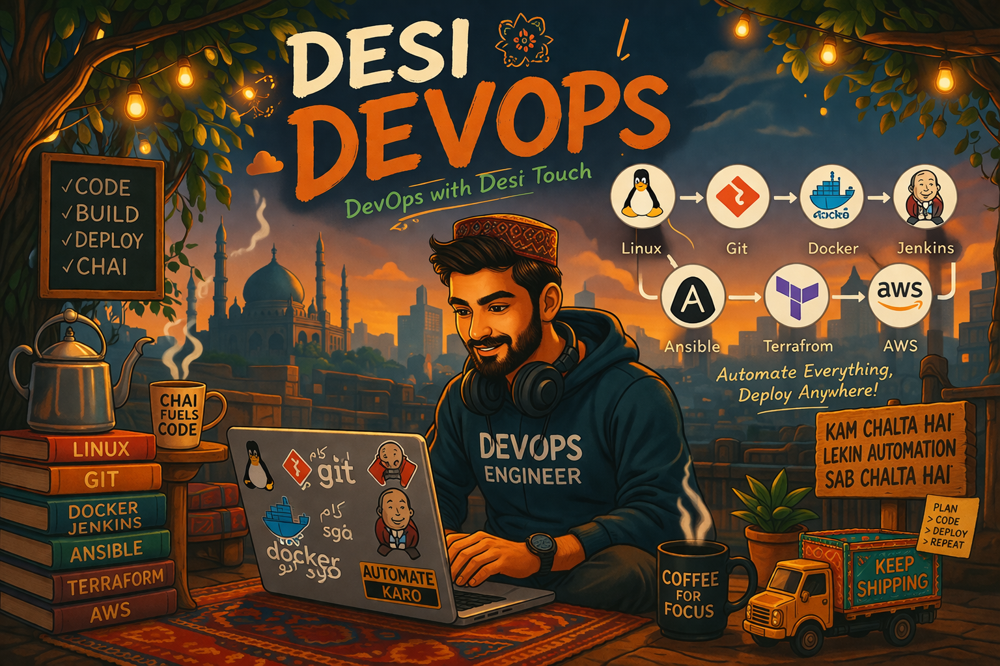

# Desi DevOps

**Desi DevOps** aik practical aur easy-to-understand learning series hai jahan hum DevOps aur Cloud ki important technologies ko **Roman English** mein samjhayen gay — simple language, real-life examples, aur step-by-step notes ke sath.

Is project ka maqsad yeh hai ke beginners se le kar intermediate learners tak, sab log **Linux se le kar AWS tak** aik structured roadmap mein seekh saken.

---

## Project Vision

Aksar DevOps ki learning English-heavy aur boring lagti hai. **Desi DevOps** ka goal yeh hai ke complex concepts ko:

* simple banaya jaye
* Roman English mein samjhaya jaye
* real-life examples ke sath explain kiya jaye
* step by step series ki form mein cover kiya jaye

Yani theory bhi hogi, commands bhi hongi, aur practical understanding bhi.

---

## Hum Kya Cover Karain Gay

Is series mein hum in topics par kaam karain gay:

* Linux
* Git & GitHub
* Docker
* Jenkins
* Ansible
* Terraform
* AWS
* aur doosray helpful DevOps tools

---

## Learning Roadmap

### 1. Linux

* Basic to advanced Linux commands
* File system aur folder structure
* Users, groups, permissions
* Package managers
* Services aur process management
* Shell basics aur scripting

### 2. Git & GitHub

* Version control basics
* Repository kya hoti hai
* Commit, push, pull, clone
* Branching aur merging
* GitHub workflows
* Collaboration aur best practices

### 3. Docker

* Containers kya hotay hain
* Images aur containers ka difference
* Docker commands
* Dockerfile
* Volumes, ports, networks
* Real-world container use cases

### 4. Jenkins

* CI/CD ka intro
* Jenkins installation
* Jobs aur pipelines
* Build, test, deploy flow
* Automation basics

### 5. Ansible

* Configuration management ka intro
* Inventory
* Ad-hoc commands
* Playbooks
* Roles aur automation examples

### 6. Terraform

* Infrastructure as Code kya hota hai
* Providers aur resources
* Variables aur outputs
* Terraform init / plan / apply
* AWS infrastructure examples

### 7. AWS

* Cloud basics
* IAM
* EC2
* S3
* VPC
* RDS
* CloudWatch
* Practical deployment concepts

### 8. Other Tools

Is series mein hum zaroorat ke mutabiq aur bhi tools cover kar saktay hain, jaise:

* Kubernetes
* Nginx
* Monitoring tools
* Logging tools
* Bash scripting tools

---

## Project Style

Is project ki khas baat yeh hogi:

* Roman English explanation
* concise notes
* real-life examples
* beginner-friendly breakdown
* practical commands
* easy revision format

Har topic ko hum is style mein cover karne ki koshish karain gay:

* Kya hota hai
* Kyun use hota hai
* Basic syntax
* Examples
* Real-life example
* Important notes

---

## Kis Ke Liye Hai?

Yeh project un logon ke liye best hai jo:

* DevOps seekhna chahtay hain
* Linux aur cloud mein strong hona chahtay hain
* Roman English mein samajhna prefer kartay hain
* interview preparation kar rahay hain
* apni practical foundation strong banana chahtay hain

---

## Project Goal

Is series ke end tak learner ko yeh understanding honi chahiye ke:

* Linux environment ko confidently use kar sake
* Git aur GitHub par code manage kar sake
* Docker containers bana aur chala sake
* Jenkins se CI/CD basics samajh sake
* Ansible se automation kar sake
* Terraform se infrastructure create kar sake
* AWS par practical resources samajh sake

---

## Repository Structure

Aik possible structure kuch is tarah ho sakta hai:

```text
Desi_DevOps/
├── Linux/
├── Git_GitHub/
├── Docker/
├── Jenkins/
├── Ansible/
├── Terraform/
├── AWS/
└── README.md
```

Aap future mein har folder ke andar alag markdown notes, command references, aur practical labs add kar saktay hain.

---

## Contribution Idea

Agar aap is project ko grow karna chahain to future mein yeh bhi add kiya ja sakta hai:

* commands cheat sheets
* mini labs
* interview questions
* practice tasks
* diagrams
* architecture examples

---

## Final Note

**Desi DevOps** sirf aik notes repository nahi, balke aik complete learning journey hogi.

Agar aap DevOps ko seedhi, practical aur relatable language mein seekhna chahtay hain, to yeh series aap ke liye hai.

---

## Stay Connected

Series abhi start ho rahi hai — aur hum step by step Linux se le kar cloud tak poora roadmap cover karain gay.

**Learn simple. Build practical. Grow with Desi DevOps.**

